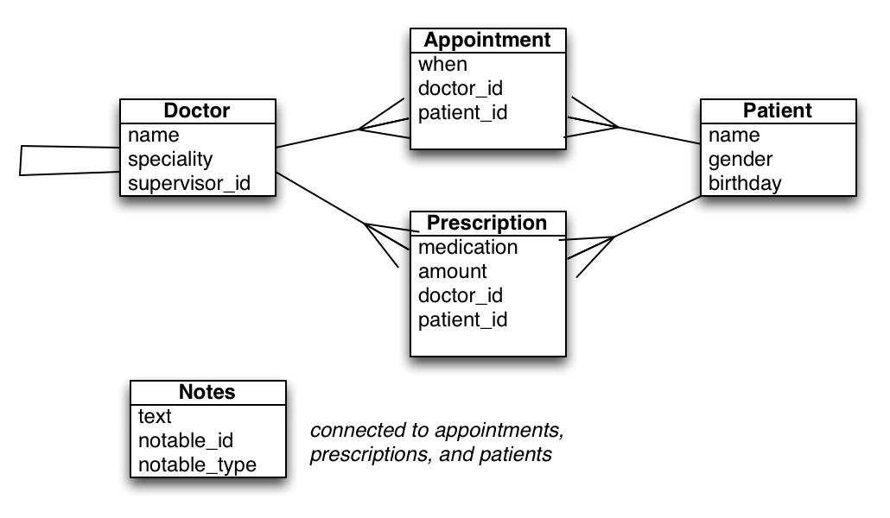
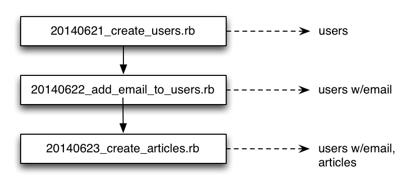

# ActiveRecord

## Week 5, Day 1

---

* Model generator
* Migrations
* Automatic columns
* Validations
* Callbacks
* Associations
* Querying
* Testing

---



---

## Model generator

```sh
rails generate model <model_name> [attributes]
```

* model
* migration
* test

---

## Migrations

A series of changes that when put together make up the current state of the database.



---

## Migration methods

```
create_table                change_column
drop_table                  remove_column
change_table                add_reference       
rename_table                remove_reference
create_join_table           add_index           
drop_join_table             rename_index
add_column                  remove_index
rename_column
```

---

## Migration options

* limit
* precision and scale
* polymorphic
* null
* default
* index

---

## Migration rake tasks

* rake db:migrate
* rake db:rollback

---

## Automatic columns

* id
* created_at
* updated_at

---

## Validations

* presence
* absence
* inclusion
* exclusion
* numericality
* length

---

## More validations

* uniqueness
* format
* acceptance
* confirmation

---

## Validation options

* allow_nil
* allow_blank
* message
* on
* if
* unless

---

## Custom validations

* custom method
* ActiveModel::Validator subclass
* ActiveModel::EachValidator subclass

---

## Callbacks on create

* before_validation
* after_validation
* before_save
* around_save
* *before_create*
* *around_create*
* *after_create*
* after_save

---

## Callbacks on update

* before_validation
* after_validation
* before_save
* around_save
* *before_update*
* *around_update*
* *after_update*
* after_save

---

## Callbacks on destroy

* before_destroy
* around_destroy
* after_destroy

---

## Associations

* belongs_to
* has_many
* has_one
* has\_and\_belongs\_to\_many
* has_many :through
* has_one :through

---

## Some association options

* dependent
* class_name
* foreign_key

---

## Polymorphic associations

```ruby

class Rating < ActiveRecord::Base
  belongs_to :rateable, polymorphic: true
end

class Film < ActiveRecord::Base
  has_many :ratings, as: :rateable
end

class Album < ActiveRecord::Base
  has_many :ratings, as: :rateable
end
```
---

## Querying

* where
* order
* limit
* offset
* includes
* select
* group
* having

---

## Scopes

```ruby
class Post
  scope :published, -> { where("published_at IS NOT NULL") }
end
```

---

## Testing

* fixtures
* factories
