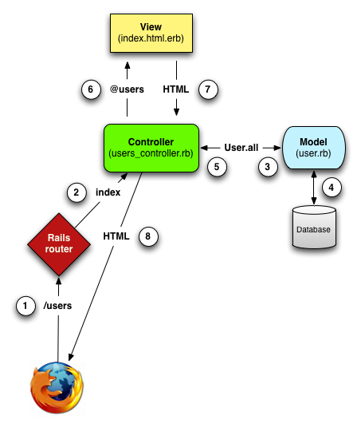

# Introduction to Rails

---



---
## What is Rails?

* Router
* MVC
* Asset pipeline
* Caching
* Generators
* A lot of stuff!

---

## Brief history of Rails

* Extracted from Basecamp in 2004
* Shipped with OS X in 2007
* Rails 2.3 ("modern Rails") in 2009
* Used by GitHub, Twitter (previously), Hulu, GroupOn, AirBnb

---

## David Heinemeier Hansson

* Creator of Rails
* Professional troll
* Race car driver


---

## Installing Rails

* `gem install rails` will install it.
* `rails -v` should show "Rails 4.1.6"

---

## Make your first Rails app!

* `rails new phone_book`

---

## What's in here?

* `app/` - your application
* `bin/` - the binary files you should use
* `config/` - configuration files
* `db/` - database seed data and migrations
* `test/` - your tests!

---

## What's in app?

* `app/assets/` - images, CSS, JS
* `app/controllers/` - controllers
* `app/helpers/` - helpers for your views
* `app/mailers/` - sends email
* `app/models/` - models
* `app/views/` - views and layouts

---

## Let's try it out

* Rails comes with _generators_
* The `scaffold` generator builds out an entire resource (model, controller, views, migrations, tests)
* Try `./bin/rails generate scaffold --help`

---

## What files does the scaffold create?

Look at:

* database migration
* model
* controller
* views
* tests

---

## Validations

Models can validate data.

```ruby
validates :name, presence: true
```
